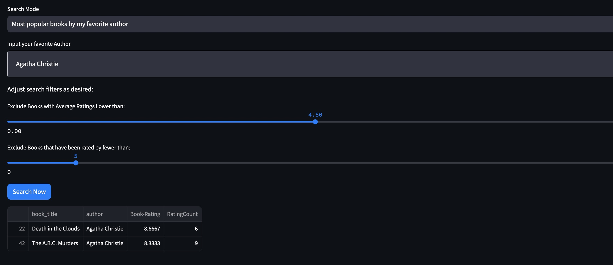
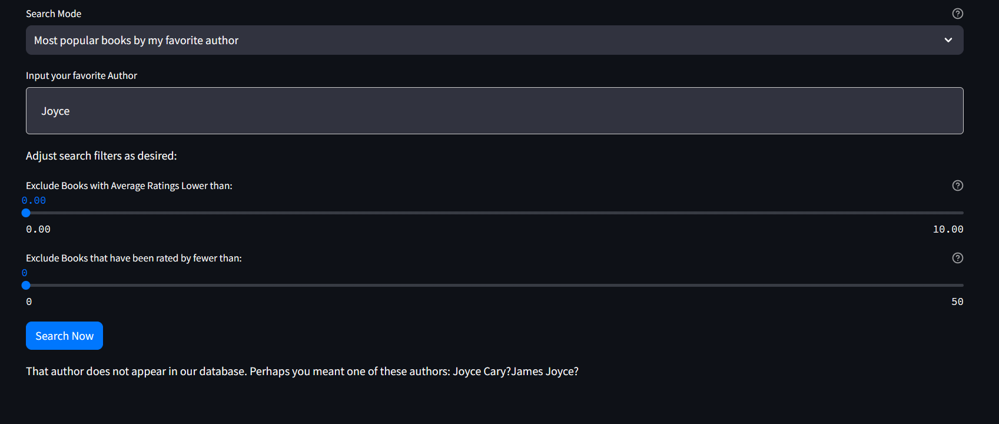
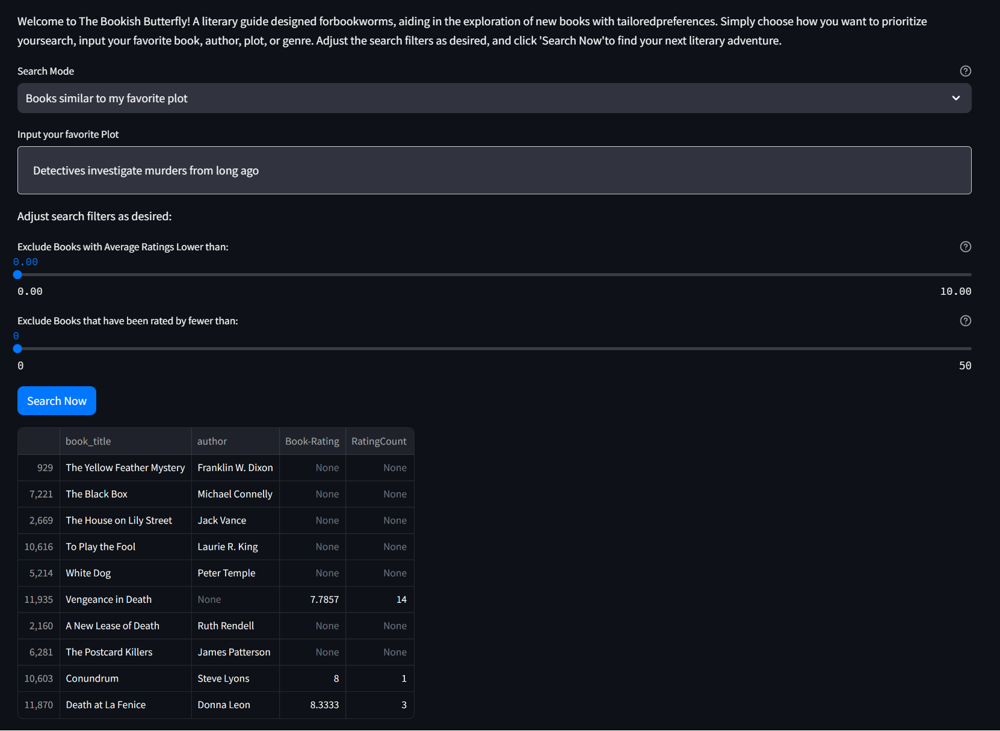

# Functional Specification

## Background:
We are creating an application to recommend books based on user input about the types of books they like.  Our book recommendation tool, "The Bookish Butterfly" employs a multi-modal approach to offer users a personalized approach. Unlike some recommender systems that only rely on ratings or genres, our model integrates multiple search modalities to provide better recommendations. We provide many options to the user depending on what they are looking for. 

## Example User Profiles

### Annie Author 
- Annie loves to read and prefers certain authors, but she is running out of books by her favorite authors!
- She wants to find new books by the authors she loves and/or new authors that write in a similar style to her favorite author.
- When looking for new books, she cares a lot about how other users have rated them.    

### Bob Book 
- Wants to find new books similar to those he has enjoyed reading in the past.
- Bob is not very technical, and needs a simple UI.  

### Gere Genre 
- Only wants to read books in his favorite Genres.

## Data Sources:

### Book Ratings
[Book Crossing Dataset](https://www.kaggle.com/datasets/ruchi798/bookcrossing-dataset/data)
Includes:
1.  BX-Book-Ratings.csv 
    - 1149779 values
    - Fields: User ID, ISBN, Book Rating
    - A copy of this data is in [data_raw/BX-Book_Ratings.csv](data_raw/BX-Book-Ratings.csv)
2.  BX-Books.csv 
    - 271379 unique values
    - Fields: ISBN, Book-Title, Book-Author, Year-Of-Publication, Publisher, Image-URL-S, Image-URL-M, Image-URL-Lnot
    - Due to file size, this file was **not** included in the repo, but can be obtained from the link above.  

### Plot Summaries
[Kaggle CMU Book Summary](https://www.kaggle.com/datasets/ymaricar/cmu-book-summary-dataset?resource=download) 

3. BookSummaries.txt
    - 16,559 values
    - Fields: Wikipedia article ID, Freebase ID, Book Title, Author, Publication Date, Book Genres, Plot Summary
    - The data from BookSummaries.txt was extracted into the file [data_raw/complete_data.csv](data_raw/complete_data.csv)

### ISBN Matching
[Google Books API](https://developers.google.com/books/)

4. Google Books API
    - ISBN (13 digit)
    - Book Title
    - This API was used to augment CMU data with ISBN Numbers to help for matching with Book Ratings dataset
    - ISBN numbers obtained via Google APIs also included in [data_raw/complete_data.csv](data_raw/complete_data.csv)
    - 
### Cleaning and Processing  
A schema for data cleaning, joining and preprocessing can be found [Here](bookworm/data/Data_Processing_Slides.pdf).

### Data Limitations
This project is a proof of concept, executed on a small dataset (~13K books  total after data cleaning), with some data sparsity even within those books. 
As such, some searches may return no or limited results. We'd love to see the work extended to a larger dataset! When a user tries to search based on a book or an author that is not in our dataset, we let them know and encourage them to search another way. 

## Data Use Cases:

### Annie Author's Use Case1:
** OBJECTIVE: ** Wants to find new books by her favorite author, Agatha Christie
or books that are similar to books by Agatha Christie.  

- **User:** Accesses recommendation tool
- **System:** Displays a drop down box asking how they want to search: (Author_Similar, Author_Favorite, Title, Plot, Genre)
- **User:** Selects Author_Similar from the drop down box 
- **System:** Displays input box for Annie to enter their favorite author 
- **User:**  Inputs "Agatha Christie" 
- **System:** Displays optional filters (e.g. minimum star rating, genre)
- **System:** Displays “Search Now” box
- **User:** Clicks “Search Now” box 
- **System:** Displays top 10 recommended books that are by Agatha Christi/similar to books by Agatha Christie

### Annie Author's Use Case2:
** OBJECTIVE: ** Wants to find only books by Christie, and that are highly rated.

- **User:** Accesses recommendation tool
- **System:** Displays a drop down box asking how they want to search: (Author_Similar, Author_Favorite, Title, Plot, Genre)
- **User:** Selects Author_Favorite from the drop down box 
- **System:** Displays input box for Annie to enter their favorite author 
- **User:**  Inputs "Agatha Christie" 
- **System:** Displays optional filters (e.g. minimum star rating, genre)
- **System:** Displays “Search Now” box
- **User:** Sets filter sliders to exclude low rated books
- **User:** Clicks “Search Now” box 
- **System:** Displays books by Christie that meet Annie's rating filter requirements. Fewer than 10 books are
returned due to filters and small size of database. 

### Annie Author's Use Case2:
** OBJECTIVE: ** Wants to find only books by author with last name Joyce.  

- **User:** Accesses recommendation tool
- **System:** Displays a drop down box asking how they want to search: (Author_Similar, Author_Favorite, Title, Plot, Genre)
- **User:** Selects Author_Favorite from the drop down box 
- **System:** Displays input box for Annie to enter their favorite author 
- **User:**  Inputs "Joyce" 
- **System:** Displays optional filters (e.g. minimum star rating, genre)
- **System:** Displays “Search Now” box
- **User:** Clicks “Search Now” box 
- **System:** Displays message stating "Sorry, we can't find that author in our database. Perhaps you meant one of
these authors: James Joyce?  Joyce Carey? 

### Bob Books Use Case 1:
OBJECTIVE: ** Wants to find books similar to a book he read several years ago about detectives solving
cold_case murders, but he can't remember the title. 

- **User:** Accesses recommendation tool
- **System:** Displays a drop down box asking how they want to search (Author_Similar,  Author_Favorite, Title, Plot, Genre)
- **User:** Selects Plot from drop down box 
- **System:** Displays input box for Bobt to enter a plot summary   
- **User:** Enters summary "Detectives solve murders from long ago"
- **System:** Displays optional filters (e.g. minimum star rating)
- **System:** Displays “Search Now” box 
- **User:** Clicks “Search Now” box 
- **System:** Gives the top 10 books that most closely match that plot. 

### Bob Books Use Case 2:
**OBJECTIVE: ** Wants to find books similar to a the book the Hunger Games. 

- **User:** Accesses recommendation tool
- **System:** Displays a drop down box asking how they want to search (Author_Similar,  Author_Favorite, Title, Plot, Genre)
- **User:** Selects Title from drop down box 
- **System:** Displays input box for Bobt to enter the book title    
- **User:** Enters "Hunger Games" 
- **System:** Displays optional filters (e.g. minimum star rating)
- **System:** Displays “Search Now” box 
- **User:** Clicks “Search Now” box 
- **System:** Gives the top 10 books that most closely match the book the Hunger Games.

### Gerry Genre's Use Case 
** OBJECTIVE: ** Wants to find new books in the Mystery Genre.
- **User:** Accesses recommendation tool
- **System:** Displays a drop down box asking how they want to search (Author_Similar,  Author_Favorite, Title,     Plot, Genre)
- **User:** Selects Genre from drop down box 
- **System:** Displays drop down box for available genres to search 
- **User:** Selects Mystery as the genre to search 
- **System:** Displays optional filters (e.g. minimum star rating)
- **User:** Sets all filters to none 
- **System:** Displays “Search Now” box 
- **User:** Clicks “Search Now” box 
- **System:** Gives the top 10 highest rated books in the Mystery genre, sorted by rating 

