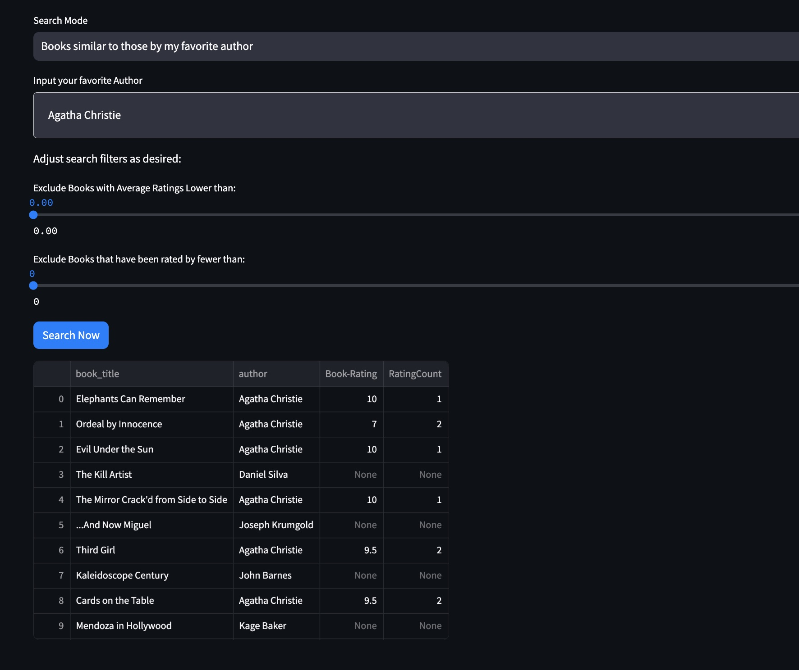
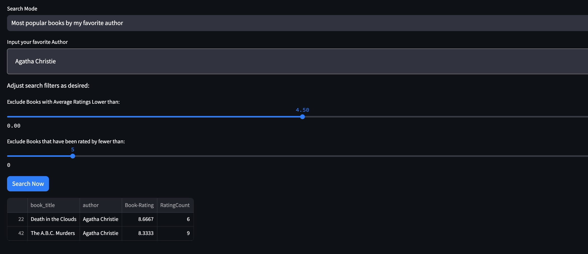
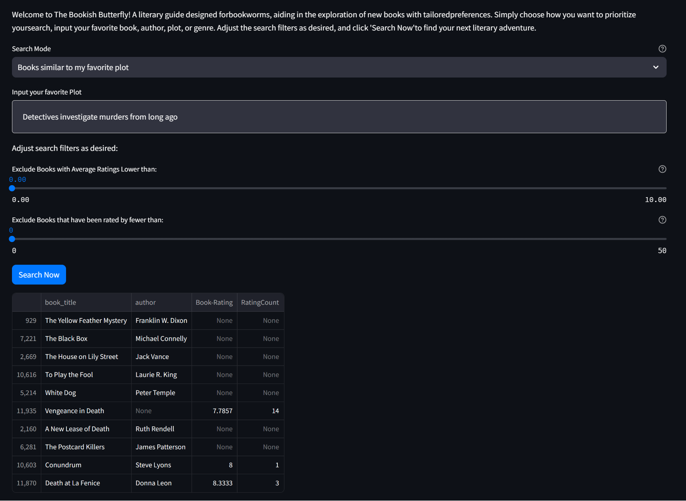
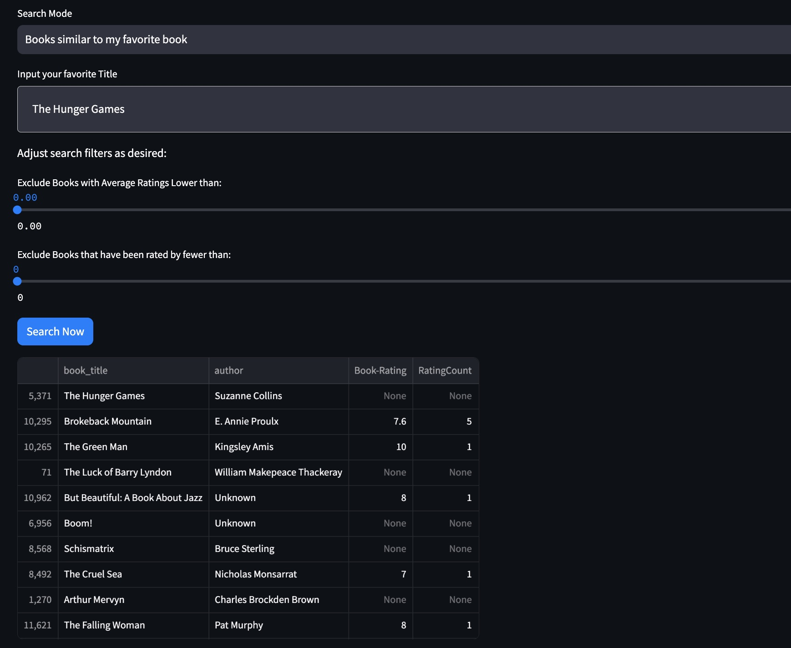
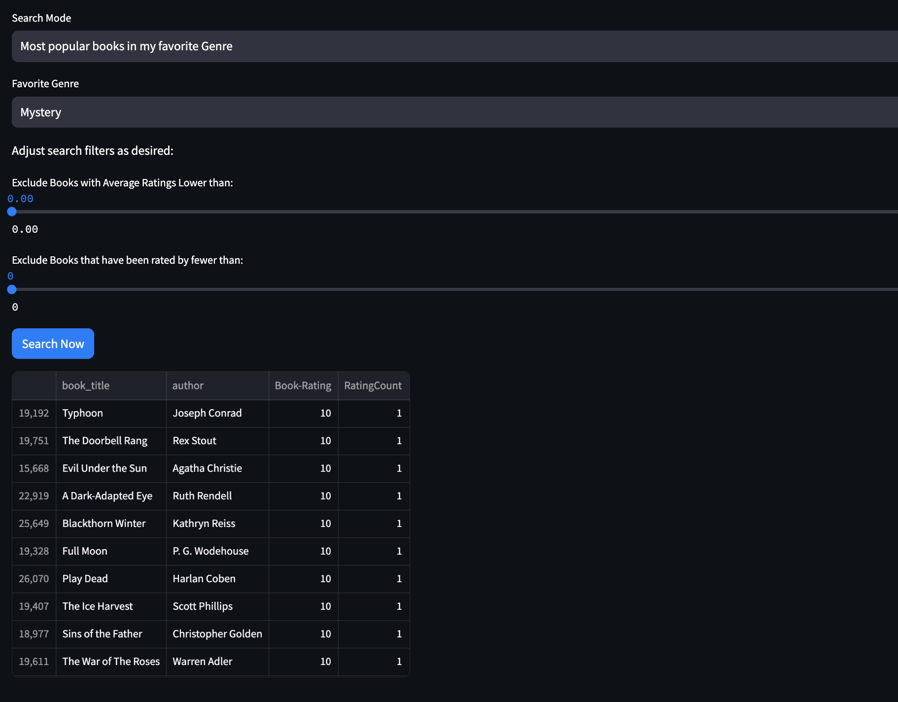

# Examples

Information regarding how to set up the environment and run the application in your local browser can be found [here](../README.md#Local-Setup-and-Environment)

### Running our Tests

You can run our tests by the command:

```bash
python -m unittest discover
```

Make sure you are in the 'bookworm' directory when running the above command. You should see that 53 tests pass.


## Home Page

Begin by reading the introduction and instructions on how to search using our tool "The Bookish Butterfly".

Click on the Search Mode and select an option to get started!

## Book Suggestions by Author

By clicking on the option: "Books similar to those by my favorite author", our search tool will give the top 10
recommended books by the inputed author AND books similar to your favorite author from our model.

OR There is an option "Most popular books by my favorite author" which generates recommened books only within that
requested author using rating analysis.

Just input the author name, hit enter, and then press the "Search Now" button at the bottom!

Here is an example when you input Agatha Christie:



You can also use the sliders at the bottom to exclude books that have lower ratings or not many reviews. Keep in mind
this may return less than 10 results. 



User's don't have to worry if they don't remember exactly how to spell the author's name. Most 
typos and misspellings won't trick the tool.  And if we are unsure which author you mean, we'll 
try to provie suggestions and get clarification. 


## Book Suggestions by Personal Interests

Users can also input a description of a book they enjoyed and our model will give them books similar to the inputed book.

Click on the "Books similar to my favorite plot" option, and search away!
    (Please be patient, it is doing work behind the scenes!)

For example: You could search for "dectives solve murders from long ago"



### But what if I don't know the plot??

Users also have flexibility to just enter the book title and we'll do the work for you!

Click on "Books similar to my favorite book", enter your favorite title and press search.

So if you enter "The Hunger Games":




This will give you results through a different search type which can broaden your options!


## Book Suggestions by Genre

If a user wants some popular books in a specific genre, they can click on "Most popular books in my favorite genre".

A new dropdown will appear to pick a genre from the list. Onwards and Searchwards!

Mystery is a fan favorite:




